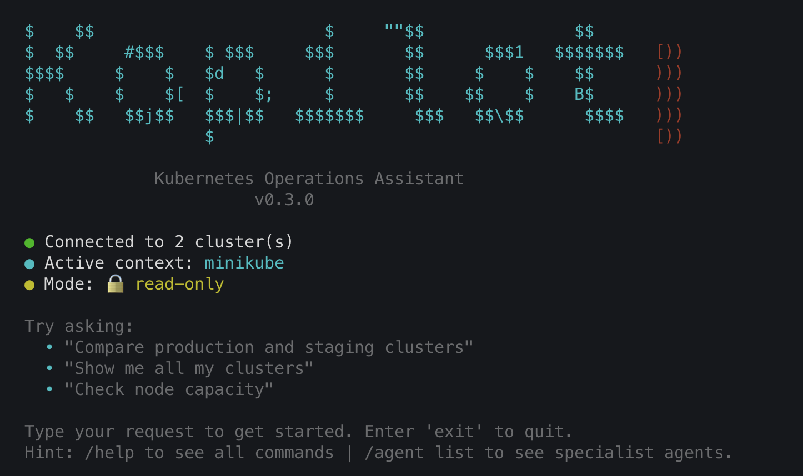

# Kopilot - Kubernetes AI Assistant

[](https://github.com/e9169/kopilot/actions/workflows/ci.yml)
[](https://codecov.io/gh/e9169/kopilot)
[](https://github.com/e9169/kopilot/actions/workflows/security.yml)
[](https://github.com/e9169/kopilot/actions/workflows/codeql.yml)
[](https://github.com/e9169/kopilot/actions/workflows/release.yml)
[](https://opensource.org/licenses/MIT)
[](https://go.dev/doc/devel/release)
[](https://goreportcard.com/report/github.com/e9169/kopilot)
[](https://github.com/e9169)
[](https://github.com/e9169)

An interactive agent built with the **official GitHub Copilot SDK** in Go that provides real-time status information, management, and troubleshooting about Kubernetes clusters from your kubeconfig file.



> **🤖 AI-Generated Project Notice**
> This entire project was created during a vibe coding session using **GitHub Copilot** (Claude Sonnet 4.5 model) with the sole purpose of having fun and exploring what's possible with AI-assisted development. While it works, it started as an experiment in AI-powered software creation.
>
> **Contributions welcome!** If you'd like to help turn this fun experiment into a serious, production-ready tool, pull requests are greatly appreciated.
> **⚠️ AI Output Disclaimer**
> Kopilot uses AI models (GPT-4o and GPT-4o-mini by default) to generate responses and interpret your requests. While designed to be helpful, **AI-generated outputs may contain errors, misinterpretations, or incomplete information**.
>
> **Important:**
>
> - Always verify AI suggestions before applying them to production systems
> - Review kubectl commands before confirming execution (especially in interactive mode)
> - AI models can hallucinate or provide outdated information
> - Use read-only mode when learning or testing to prevent unintended changes
> - This tool is provided "as-is" without warranties - see [LICENSE](LICENSE) for details
>
> **You are responsible for understanding and verifying all operations performed on your Kubernetes clusters.**

## Features

- 🔍 **List All Clusters**: View all Kubernetes clusters configured in your kubeconfig
- 🔍 **Detailed Status**: Get comprehensive status information for specific clusters
- ⚖️ **Compare Clusters**: Side-by-side comparison of multiple clusters
- 🏥 **Health Monitoring**: Real-time node and **pod health** tracking across all clusters
- ⚡ **Parallel Execution**: Check all clusters simultaneously for 5-10x faster results
- 🤖 **Interactive Agent**: Natural language interface powered by GitHub Copilot
- 🛠️ **kubectl Integration**: Execute kubectl commands through natural language
- 🔐 **Safe by Default**: Read-only mode protects against accidental changes
- 🔓 **Interactive Mode**: Confirmation prompts for write operations with clear visibility
- 💎 **Persistent Quota Display**: Copilot Premium request quota shown in the prompt prefix with color-coded indicators
- 💡 **Dynamic Example Suggestions**: Shows 3 random example prompts on each launch to help users get started
- 📄 **Plain-Text Output**: Responses use emoji + uppercase headers (e.g. `🔵 STATUS:`, `⚠️ ISSUES:`) for clean, readable output without markdown tables or bold formatting
- 🎯 **Type-Safe Tools**: Uses Copilot SDK's DefineTool for automatic schema generation
- 💰 **Smart Cost Optimization**: Intelligent model selection based on task complexity (see [docs/MODEL_SELECTION.md](docs/MODEL_SELECTION.md))
  - Uses `gpt-5.4-mini` for simple queries (list, status, health checks)
  - Automatically upgrades to `claude-sonnet-4.6` for troubleshooting and complex operations
  - 50-70% cost reduction while maintaining quality for critical tasks
- 🎭 **Specialist Agent Personas**: Five focused AI personas for advanced operations (see [docs/AGENTS.md](docs/AGENTS.md))
  - `--agent debugger` — root cause analysis, log correlation, pod failure diagnosis
  - `--agent security` — RBAC auditing, privilege escalation detection, network policy review
  - `--agent optimizer` — resource right-sizing, HPA/VPA recommendations, cost optimization
  - `--agent gitops` — Flux/ArgoCD sync status, drift detection, reconciliation diagnostics
  - `--agent sanitizer` — workload linting, best-practice scoring, A–F cluster grading
  - Switch agents at runtime with `/agent <name>` — no restart required
- 🚀 **GitHub Copilot CLI-inspired UX**: Clean, modern interface with chevron prompt (❯) and streamlined design

## Architecture

The agent uses the **official GitHub Copilot SDK** to create an interactive assistant that can query your Kubernetes clusters. The SDK handles model invocation, tool selection, and response generation, while our custom tools provide the actual cluster information.

## Supported Platforms

Kopilot is compiled and released for:

| OS | Architecture | Tested in CI | Binary Available |
| -- | ------------ | ------------ | ---------------- |
| Linux | amd64 | ✅ | ✅ |
| Linux | arm64 | ❌ | ✅ |
| macOS | amd64 (Intel) | ❌ | ✅ |
| macOS | arm64 (Apple Silicon) | ✅ | ✅ |
| Windows | amd64 | ❌ | ✅ |
| Windows | arm64 | ❌ | ✅ |

**Note:** All platforms are verified to compile successfully in CI. Full test suite runs on Ubuntu (linux/amd64) and macOS (darwin/arm64).

## Quick Start

### Quick install (recommended)

Install the latest release with a single command:

```bash
curl -fsSL https://raw.githubusercontent.com/e9169/kopilot/main/install.sh | bash
```

### Manual install

```bash
# Install dependencies
make deps

# Build the binary
make build

# Run kopilot
./bin/kopilot

# Or install and run from anywhere
make install
kopilot
```

## Prerequisites

- **Go 1.26 or later** - For building from source
- **kubectl** - Kubernetes command-line tool
- **AI provider** (choose one):
  - GitHub Copilot: requires GitHub Copilot CLI and subscription
  - OpenAI: set `OPENAI_API_KEY` (compatible with any OpenAI-compatible endpoint via `OPENAI_BASE_URL`)
  - Gemini: set `GEMINI_API_KEY` or configure Application Default Credentials
- Access to Kubernetes clusters via kubeconfig
- Valid kubeconfig file at `~/.kube/config` or set via `KUBECONFIG`

### Dependencies

This project uses the following key dependencies:

- **GitHub Copilot SDK**: `github.com/github/copilot-sdk/go@v0.2.2`
- **OpenAI Go client**: `github.com/sashabaranov/go-openai@v1.41.2`
- **Google GenAI SDK**: `google.golang.org/genai@v1.54.0`
- **Kubernetes Client**: `k8s.io/client-go@v0.36.2`
- **Kubernetes API**: `k8s.io/api@v0.36.2`

Run `go mod verify` to ensure dependency integrity.

### Compatibility Matrix

| Component | Minimum Version | Recommended Version | Notes |
| --------- | --------------- | ------------------- | ----- |
| Go | 1.26.0 | 1.26.0 | Required for building |
| Copilot CLI | any | latest | Required only for Copilot provider |
| Copilot SDK | v0.2.2 | v0.2.2 | Current version |
| kubectl | Any | Latest | Must be in PATH |
| Kubernetes | 1.28+ | 1.36.2 | API compatibility |

## Installation

### 1. Authenticate with your AI provider

Kopilot supports three providers. Set up whichever you prefer:

#### GitHub Copilot (default)

Requires a GitHub Copilot subscription and the Copilot CLI:

```bash
# Install via npm
npm install -g @github/copilot

# Authenticate
copilot auth login
```

Alternatively install via Homebrew or the GitHub CLI extension:

```bash
brew install github/gh-copilot/gh-copilot
# or
gh extension install github/gh-copilot
```

#### OpenAI (or any OpenAI-compatible endpoint)

```bash
export OPENAI_API_KEY="sk-..."
# Optional: point to a local or compatible endpoint
# export OPENAI_BASE_URL="http://localhost:11434/v1"
```

#### Google Gemini

```bash
export GEMINI_API_KEY="AI..."
# Or configure Application Default Credentials (gcloud auth application-default login)
```

### 2. Install Kopilot

#### Automated installation (recommended)

Install the latest release with a single command:

```bash
curl -fsSL https://raw.githubusercontent.com/e9169/kopilot/main/install.sh | bash
```

This will automatically:

- Detect your OS and architecture
- Download the latest release
- Install to `/usr/local/bin` (or `~/.local/bin` if you prefer)
- Make the binary executable

#### Pre-built binaries

Download pre-built binaries from the [releases page](https://github.com/e9169/kopilot/releases).

#### Build from source

```bash
git clone https://github.com/e9169/kopilot.git
cd kopilot
make deps
make build
```

### 3. Verify Installation

```bash
kopilot --version
```

## Usage

```bash
# Run in read-only mode (default - safest)
./bin/kopilot

# Run in interactive mode (asks before write operations)
./bin/kopilot --interactive

# Run with a specialist agent persona
./bin/kopilot --agent debugger
./bin/kopilot --agent security
./bin/kopilot --agent optimizer
./bin/kopilot --agent gitops
./bin/kopilot --agent sanitizer

# Combine agent and mode
./bin/kopilot --agent optimizer --interactive

# Show version information
./bin/kopilot --version

# Run with verbose logging
./bin/kopilot -v

# Show help
./bin/kopilot --help

# Use custom kubeconfig
KUBECONFIG=/path/to/kubeconfig ./bin/kopilot

# Use custom kubeconfig and context
./bin/kopilot --kubeconfig /path/to/kubeconfig --context my-context

# JSON output for tool responses
./bin/kopilot --output json
```

### Execution Modes

#### 🔒 Read-Only Mode (Default)

- Blocks all write operations (scale, delete, apply, etc.)
- Safe for production environments and exploratory use
- Perfect for monitoring, troubleshooting, and viewing cluster state
- Use `--interactive` flag to enable writes with confirmation

#### ⚡ Interactive Mode

- Asks for confirmation before executing write operations
- Shows exactly what command will run
- Allows cancellation of dangerous operations
- Can be enabled at startup with `--interactive` flag

#### Runtime Mode Switching

- `/readonly` - Switch to read-only mode
- `/interactive` - Switch to interactive mode
- `/mode`, `/status` - Show current execution mode

#### Runtime Agent Switching

- `/agent` or `/agent list` - Show active agent and available roster
- `/agent debugger` - Switch to the Debugger specialist
- `/agent security` - Switch to the Security auditor
- `/agent optimizer` - Switch to the Optimizer specialist
- `/agent gitops` - Switch to the GitOps specialist
- `/agent sanitizer` - Switch to the Sanitizer (best-practice scoring)
- `/agent default` - Return to the default generalist persona

#### Runtime Context Switching

- `/context list` - List all kubeconfig contexts
- `/context use <name>` - Switch active Kubernetes context

#### MCP Servers

- `/mcp list` - List configured MCP servers
- `/mcp add <name> <url>` - Add or update an MCP server (takes effect immediately)
- `/mcp delete <name>` - Remove an MCP server

#### Model Selection

- `/model` - Show current model or routing mode
- `/model <name>` - Force a specific model for this session
- `/model reset` - Re-enable automatic model routing

#### Session Management

- `/clear`, `/new` - Start a fresh conversation
- `/compact` - Summarize history to save context window
- `/usage` - Show session duration, turns, and quota
- `/last` - Re-show the last full AI response
- `/copy` - Copy the last response to clipboard
- `/streamer [on|off]` - Hide quota badge (useful for screen-sharing)

#### Help

- `/help` - Show all available runtime commands

#### Shortcuts

| Shortcut | Description |
| -------- | ----------- |
| `@<filepath>` | Attach a local file to the next message for AI analysis |
| `!<command>` | Run a shell command directly without involving AI |
| `Ctrl+C` | Cancel current input or abort an in-progress AI response |
| `Ctrl+D` | Exit Kopilot |

### Command-Line Flags

- `--version` - Display version information
- `--interactive` - Enable interactive mode (asks before write operations)
- `--agent` - Set specialist agent persona: `default`, `debugger`, `security`, `optimizer`, `gitops`, `sanitizer` (default: `default`)
- `--kubeconfig` - Path to kubeconfig file (default: `$KUBECONFIG` or `~/.kube/config`)
- `--context` - Override kubeconfig context
- `--output` - Output format: `text` or `json`
- `--mcp-config` - Path to MCP server config file (default: `~/.kopilot/mcp.json`)
- `-v, --verbose` - Enable verbose logging with timestamps
- `--help` - Show usage information

### Environment Variables

**Optional:**

- `KUBECONFIG` - Path to kubeconfig file (default: `~/.kube/config`)

**Optional - Model Configuration:**

- `KOPILOT_MODEL_COST_EFFECTIVE` - Override AI model for simple queries (default: `gpt-5.4-mini`)
- `KOPILOT_MODEL_PREMIUM` - Override AI model for complex operations (default: `claude-sonnet-4.6`)

**Optional - Execution:**

- `KOPILOT_KUBECTL_TIMEOUT` - Timeout for kubectl commands, e.g. `60s`, `2m` (default: `30s`). Invalid values fall back to the default.

**Example:**

```bash
# Use different AI models
export KOPILOT_MODEL_COST_EFFECTIVE="gpt-3.5-turbo"
export KOPILOT_MODEL_PREMIUM="gpt-4"
./bin/kopilot

# Use custom kubeconfig
export KUBECONFIG="/path/to/custom/kubeconfig"
./bin/kopilot --interactive
```

### Interactive Session

When you start kopilot, it displays:

- Connection status and cluster information
- Current execution mode (read-only or interactive)
- Active specialist agent (if not default)
- 3 random example prompts to help you get started

You can then interact naturally:

```bash
❯ Show me pods in the default namespace on dev-mgmt-01
❯ Scale the nginx deployment to 3 replicas in prod-wrk-01
❯ Check the logs of the api pod in namespace apps
❯ What's the status of nodes in the SEML region clusters?
❯ exit
```

The agent will execute kubectl commands on your behalf and explain the results. Example prompts are randomized on each launch to help you discover different capabilities.

### Specialist Agent Personas

Kopilot ships with five domain-specific AI personas that focus the assistant on a particular operational area. All specialist agents always use the premium model for the best reasoning quality.

| Agent | Flag | Focus |
| ----- | ---- | ----- |
| `default` | _(default)_ | General Kubernetes operations |
| `debugger` 🔍 | `--agent debugger` | Root cause analysis, log correlation, pod failures |
| `security` 🛡️ | `--agent security` | RBAC auditing, privilege checks, network policies |
| `optimizer` ⚡ | `--agent optimizer` | Resource right-sizing, HPA/VPA, cost savings |
| `gitops` 🔄 | `--agent gitops` | Flux/ArgoCD sync, drift detection, reconciliation |
| `sanitizer` 🧹 | `--agent sanitizer` | Workload linting, best-practice scoring, A–F cluster grading |

Agents can be switched at runtime with `/agent <name>`. See [docs/AGENTS.md](docs/AGENTS.md) for full details and example prompts.

## Available Tools

1. **list_clusters** - Lists all clusters from kubeconfig
2. **get_cluster_status** - Gets detailed status for a specific cluster
3. **compare_clusters** - Compares multiple clusters side by side
4. **check_all_clusters** - Fast parallel health check of all clusters (🚀 5-10x faster)
5. **kubectl_exec** - Execute kubectl commands against any cluster

## References

- [GitHub Copilot SDK](https://github.com/github/copilot-sdk)
- [Copilot CLI Docs](https://docs.github.com/en/copilot/using-github-copilot/using-github-copilot-in-the-command-line)

## Author

**Eneko P** ([@e9169](https://github.com/e9169))
📍 Based in Sweden

## License

MIT License - Copyright © 2026 Eneko Pérez
