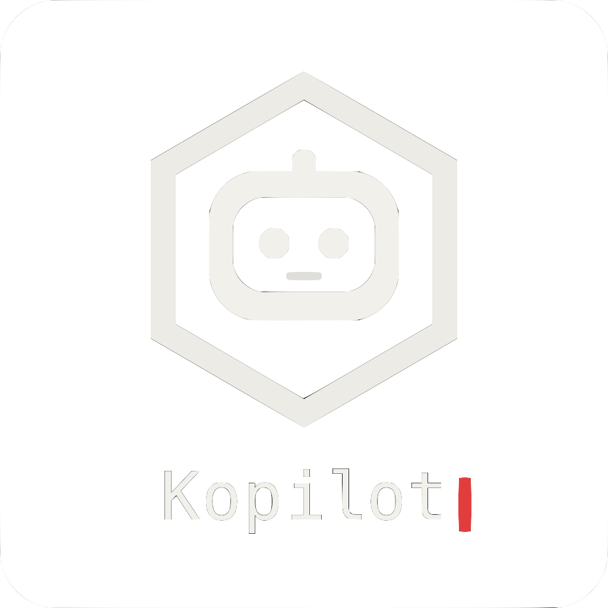

<div style="text-align: center; padding: 4rem 0;">
  
  <h1 style="font-size: 3rem; margin-bottom: 1rem; background: linear-gradient(135deg, #06b6d4 0%, #8b5cf6 50%, #ec4899 100%); -webkit-background-clip: text; -webkit-text-fill-color: transparent; background-clip: text;">AI KUBERNETES ASSISTANT</h1>
  <p style="font-size: 1.25rem; color: #d1d5db; margin-bottom: 2rem;">Deploy services, scale pods, debug issues, manage configs.<br>All from your terminal.</p>
  <a href="https://github.com/{{ site.repository }}" class="btn" style="background: linear-gradient(135deg, #06b6d4 0%, #8b5cf6 100%); color: white; padding: 1rem 2rem; text-decoration: none; border-radius: 0.5rem; display: inline-block; margin: 0.5rem; box-shadow: 0 4px 20px rgba(139, 92, 246, 0.5), 0 0 30px rgba(6, 182, 212, 0.3);">Get Started</a>
  <a href="/kopilot/docs" class="btn" style="background: linear-gradient(135deg, #8b5cf6 0%, #ec4899 100%); color: white; padding: 1rem 2rem; text-decoration: none; border-radius: 0.5rem; display: inline-block; margin: 0.5rem; box-shadow: 0 4px 20px rgba(236, 72, 153, 0.5), 0 0 30px rgba(139, 92, 246, 0.3);">View Docs</a>
</div>

---

## ⟩ Quick Start

First, install GitHub Copilot CLI (choose one):

```bash
# Option A: Using npm
npm install -g @githubnext/github-copilot-cli
copilot auth login

# Option B: Using GitHub CLI extension
gh extension install github/gh-copilot
```

Then build Kopilot from source:

```bash
git clone https://github.com/{{ site.repository }}.git
cd kopilot
make deps
make build
./bin/kopilot
```

---

## ⟩ Features

<div style="display: grid; grid-template-columns: repeat(auto-fit, minmax(250px, 1fr)); gap: 2rem; margin: 3rem 0;">
  <div style="padding: 1.5rem; border: 2px solid transparent; background: linear-gradient(#0a1628, #0a1628) padding-box, linear-gradient(135deg, #06b6d4, #8b5cf6) border-box; border-radius: 0.5rem;">
    <h3 style="background: linear-gradient(135deg, #06b6d4, #0ea5e9); -webkit-background-clip: text; -webkit-text-fill-color: transparent; background-clip: text;">� Cluster Status</h3>
    <p>View all Kubernetes clusters from your kubeconfig with detailed status information.</p>
  </div>
  
  <div style="padding: 1.5rem; border: 2px solid transparent; background: linear-gradient(#0a1628, #0a1628) padding-box, linear-gradient(135deg, #8b5cf6, #ec4899) border-box; border-radius: 0.5rem;">
    <h3 style="background: linear-gradient(135deg, #8b5cf6, #a78bfa); -webkit-background-clip: text; -webkit-text-fill-color: transparent; background-clip: text;">⚖️ Compare Clusters</h3>
    <p>Side-by-side comparison of multiple clusters to spot differences quickly.</p>
  </div>
  
  <div style="padding: 1.5rem; border: 2px solid transparent; background: linear-gradient(#0a1628, #0a1628) padding-box, linear-gradient(135deg, #ec4899, #06b6d4) border-box; border-radius: 0.5rem;">
    <h3 style="background: linear-gradient(135deg, #ec4899, #f472b6); -webkit-background-clip: text; -webkit-text-fill-color: transparent; background-clip: text;">🏥 Health Monitoring</h3>
    <p>Real-time node and pod health tracking across all your clusters.</p>
  </div>
  
  <div style="padding: 1.5rem; border: 2px solid transparent; background: linear-gradient(#0a1628, #0a1628) padding-box, linear-gradient(135deg, #06b6d4, #14b8a6) border-box; border-radius: 0.5rem;">
    <h3 style="background: linear-gradient(135deg, #06b6d4, #22d3ee); -webkit-background-clip: text; -webkit-text-fill-color: transparent; background-clip: text;">⚡ Parallel Execution</h3>
    <p>Check all clusters simultaneously for 5-10x faster results.</p>
  </div>
  
  <div style="padding: 1.5rem; border: 2px solid transparent; background: linear-gradient(#0a1628, #0a1628) padding-box, linear-gradient(135deg, #14b8a6, #8b5cf6) border-box; border-radius: 0.5rem;">
    <h3 style="background: linear-gradient(135deg, #14b8a6, #2dd4bf); -webkit-background-clip: text; -webkit-text-fill-color: transparent; background-clip: text;">🛠️ kubectl Integration</h3>
    <p>Execute kubectl commands through natural language with interactive confirmations.</p>
  </div>
  
  <div style="padding: 1.5rem; border: 2px solid transparent; background: linear-gradient(#0a1628, #0a1628) padding-box, linear-gradient(135deg, #8b5cf6, #06b6d4) border-box; border-radius: 0.5rem;">
    <h3 style="background: linear-gradient(135deg, #a78bfa, #8b5cf6); -webkit-background-clip: text; -webkit-text-fill-color: transparent; background-clip: text;">🔐 Safe by Default</h3>
    <p>Read-only mode protects against accidental changes. Your kubeconfig stays local.</p>
  </div>
  
  <div style="padding: 1.5rem; border: 2px solid transparent; background: linear-gradient(#0a1628, #0a1628) padding-box, linear-gradient(135deg, #ec4899, #8b5cf6) border-box; border-radius: 0.5rem;">
    <h3 style="background: linear-gradient(135deg, #ec4899, #f472b6); -webkit-background-clip: text; -webkit-text-fill-color: transparent; background-clip: text;">💰 Smart Model Selection</h3>
    <p>Automatically switches between GPT-4o-mini for simple queries and GPT-4o for complex tasks, reducing costs by 50-70%.</p>
  </div>
  
  <div style="padding: 1.5rem; border: 2px solid transparent; background: linear-gradient(#0a1628, #0a1628) padding-box, linear-gradient(135deg, #06b6d4, #ec4899) border-box; border-radius: 0.5rem;">
    <h3 style="background: linear-gradient(135deg, #06b6d4, #8b5cf6); -webkit-background-clip: text; -webkit-text-fill-color: transparent; background-clip: text;">🤖 GitHub Copilot SDK</h3>
    <p>Built with the official GitHub Copilot SDK for natural language interaction with your clusters.</p>
  </div>
</div>

---

## ⟩ Any Kubernetes, Anywhere

<p style="text-align: center; font-size: 1.2rem; color: #d1d5db; margin-bottom: 2rem;">Works with your existing kubeconfig. No installation on clusters required.</p>

<div style="display: grid; grid-template-columns: repeat(auto-fit, minmax(200px, 1fr)); gap: 1.5rem; margin: 3rem 0;">
  <div style="padding: 1.5rem; border: 2px solid transparent; background: linear-gradient(#0a1628, #0a1628) padding-box, linear-gradient(135deg, #06b6d4, #0ea5e9) border-box; border-radius: 0.75rem; text-align: center;">
    <div style="font-size: 2rem; margin-bottom: 0.5rem;">☁️</div>
    <h4 style="background: linear-gradient(135deg, #06b6d4, #0ea5e9); -webkit-background-clip: text; -webkit-text-fill-color: transparent; background-clip: text; margin: 0.5rem 0;">Managed Kubernetes</h4>
    <p style="font-size: 0.9rem; color: #9ca3af; margin: 0;">AWS EKS • GCP GKE • Azure AKS</p>
  </div>
  
  <div style="padding: 1.5rem; border: 2px solid transparent; background: linear-gradient(#0a1628, #0a1628) padding-box, linear-gradient(135deg, #8b5cf6, #a78bfa) border-box; border-radius: 0.75rem; text-align: center;">
    <div style="font-size: 2rem; margin-bottom: 0.5rem;">💻</div>
    <h4 style="background: linear-gradient(135deg, #8b5cf6, #a78bfa); -webkit-background-clip: text; -webkit-text-fill-color: transparent; background-clip: text; margin: 0.5rem 0;">Local Clusters</h4>
    <p style="font-size: 0.9rem; color: #9ca3af; margin: 0;">Minikube • Kind • k3s • Docker Desktop</p>
  </div>
  
  <div style="padding: 1.5rem; border: 2px solid transparent; background: linear-gradient(#0a1628, #0a1628) padding-box, linear-gradient(135deg, #ec4899, #f472b6) border-box; border-radius: 0.75rem; text-align: center;">
    <div style="font-size: 2rem; margin-bottom: 0.5rem;">🏢</div>
    <h4 style="background: linear-gradient(135deg, #ec4899, #f472b6); -webkit-background-clip: text; -webkit-text-fill-color: transparent; background-clip: text; margin: 0.5rem 0;">On-Premise</h4>
    <p style="font-size: 0.9rem; color: #9ca3af; margin: 0;">OpenShift • Rancher • Vanilla K8s</p>
  </div>
</div>

<p style="text-align: center; font-size: 1rem; color: #9ca3af; margin-top: 2rem;">If kubectl can reach it, Kopilot can manage it.</p>
